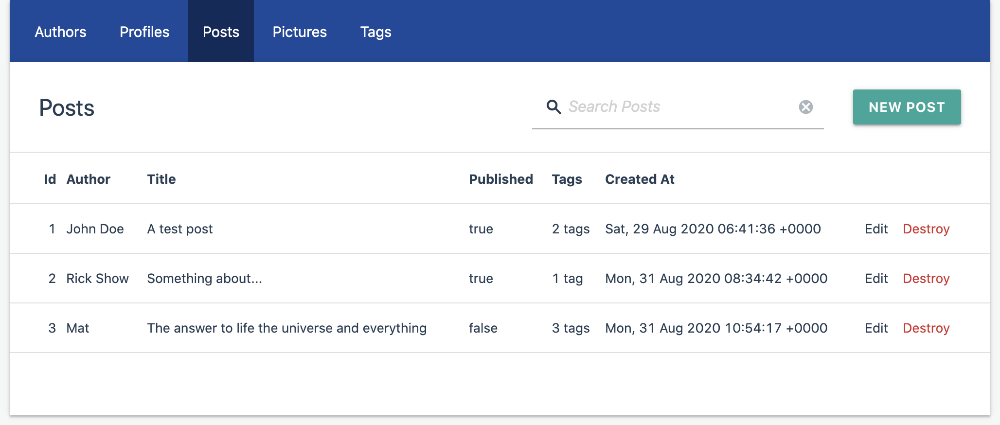

# Administrate Materialize Theme
[](https://badge.fury.io/rb/administrate-materialize-theme)
[](https://rubygems.org/gems/administrate-materialize-theme)
[](https://github.com/blocknotes/administrate-materialize-theme/actions/workflows/linters.yml)
[](https://github.com/blocknotes/administrate-materialize-theme/actions/workflows/specs.yml)

A Material theme for [Administrate](https://github.com/thoughtbot/administrate), based on [Materialize](https://materializecss.com) framework.

Features:

- easy to install, just include CSS/JS to apply the theme to a default Administrate structure;
- Material Design responsive theme;
- customizable via SASS variables;
- allow to use *Materialize* components in the admin.



Please :star: if you like it.

## Installation

- Add a SASS/SCSS gem to your Gemfile (ex. `gem 'sassc'`)
- After installing Administrate, add to *Gemfile*: `gem 'administrate-materialize-theme'` (and execute `bundle`)
- Edit *app/assets/config/manifest.js*, adding at the end:

```js
//= link administrate-materialize-theme/theme.css
//= link administrate-materialize-theme/theme.js
```

- Edit *app/views/layouts/admin/application.html.erb* (you can generate it using `rails generate administrate:views:layout`), adding before head closing tag:

```html
<%= stylesheet_link_tag 'administrate-materialize-theme/theme', media: 'all' %>
<%= javascript_include_tag 'administrate-materialize-theme/theme' %>
```

## Customizations

To change Materialize variables it's necessary to create a new *.scss* (or *.sass*) file like this one (ex. *admin.scss*):

```scss
// app/assets/stylesheets/admin.scss
$primary-color: #FB1;
@import 'administrate-materialize-theme/theme';
```

And replace the link tag in the *application.html.erb* with: `<%= stylesheet_link_tag 'admin', media: 'all' %>`

For the complete list of options take a look [here](app/assets/stylesheets/administrate-materialize-theme/components/_variables.scss).

## Extra features

- Sidebar example:

```html
<div class="row">
  <div class="col s3">
    <section class="mt-sidebar z-depth-1">
      <h3>Sidebar</h3>
      <p>Some content</p>
    </section>
  </div>
  <div class="col s9">
    <section class="main-content__body main-content__body--flush">
      <!-- ... -->
    </section>
  </div>
</div>
```

## Do you like it? Star it!

If you use this component just star it. A developer is more motivated to improve a project when there is some interest.

Or consider offering me a coffee, it's a small thing but it is greatly appreciated: [about me](https://www.blocknot.es/about-me).

## Contributors

- [Mattia Roccoberton](https://blocknot.es/): author

## License

The gem is available as open source under the terms of the [MIT License](https://opensource.org/licenses/MIT).
