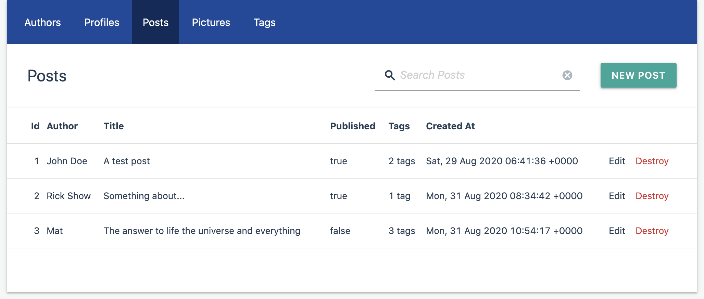

# Administrate Materialize Theme [](https://badge.fury.io/rb/administrate-materialize-theme)
A Material theme form [Administrate](https://github.com/thoughtbot/administrate), based on [Materialize](https://materializecss.com) framework.

Features:
- no structural changes are required, just include CSS/JS;
- Material design responsive theme;
- customizable using SASS variables;
- allow to use *Materialize* in the admin.



## Installation
- If not already installed Administrate, set it up
- Add to *Gemfile*: `gem 'administrate-materialize-theme'` (and execute `bundle`)
- Edit *app/assets/config/manifest.js*, adding at the end:

```js
//= link administrate-materialize-theme/theme.css
//= link administrate-materialize-theme/theme.js
```

- Edit *app/views/layouts/admin/application.html.erb* (you can generate it using `rails generate administrate:views:layout`), adding before head closing tag:

```html
<%= stylesheet_link_tag 'administrate-materialize-theme/theme', media: 'all' %>
<%= javascript_include_tag 'administrate-materialize-theme/theme' %>
```

## Customizations
To change Materialize variables it's necessary to create a new *.scss* (or *.sass*) file like this one (ex. *admin.scss*):

```scss
// app/assets/stylesheets/admin.scss
$primary-color: #FB1;
@import 'administrate-materialize-theme/theme';
```

And replace the link tag in the *application.html.erb* with: `<%= stylesheet_link_tag 'admin', media: 'all' %>`

For the complete list of options take a look [here](app/assets/stylesheets/administrate-materialize-theme/components/_variables.scss).

## Do you like it? Star it!
If you use this component just star it. A developer is more motivated to improve a project when there
 is some interest.

## Contributors
- [Mattia Roccoberton](https://blocknot.es/): author

## License
The gem is available as open source under the terms of the [MIT License](https://opensource.org/licenses/MIT).
